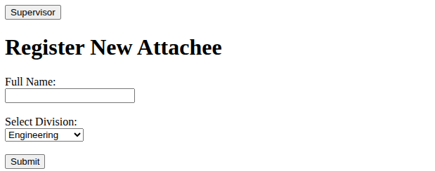
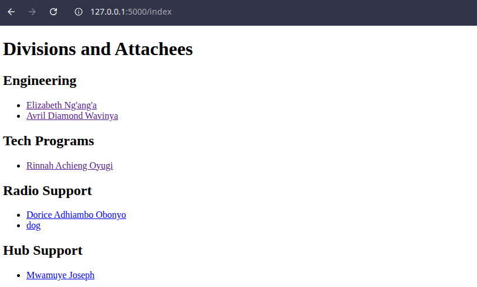

# Attachee Task Management System 🚀

A simple web-based system built with **Flask**, **HTML** and **Python** that helps a supervisor manage industrial attachees (interns) by grouping them into divisions, assigning tasks, collecting feedback, and scoring performance.

---

## 🔧 Features

- 👥 Register attachees into divisions (e.g., Tech support, Engineering, Hub support and Radio support)
- 🧠 Object-Oriented backend using Python classes
- ✅ Prevent duplicate attachee registration
- 📝 Assign tasks to attachees by supervisor
- 💬 Collect feedback per task from attachees
- 📈 View feedback and performance per attachee
- 🔁 Easily extendable using lists or dictionaries as in-memory databases
- 📎 Built with Flask, HTML, and simple Python logic

---

## 🔧 Supervisor Actions
- Access dashboard via index.html

- Assign tasks to attachees based on division

- View registered attachees and their submitted feedback

## 🧑‍💼 Attachee Actions
- Register with a name and department

- Automatically redirected to their task portal

- Submit feedback per assigned task

- Return to main route anytime using back button
 ### Attachee page, where they sign in/Register

### This is where supervisor navigates

### This is where supervisor navigates

### This is where supervisor navigates

## 🔮 Future Enhancements
- Persistent database (e.g., SQLite or PostgreSQL)

- User login/authentication (attachees + supervisors)

- Score calculation & analytics dashboard

- Task deadlines, status tracking

- Export reports to Excel/PDF
